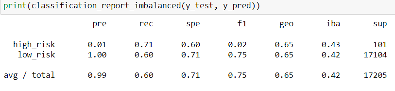
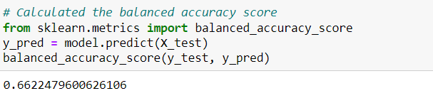
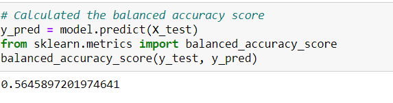
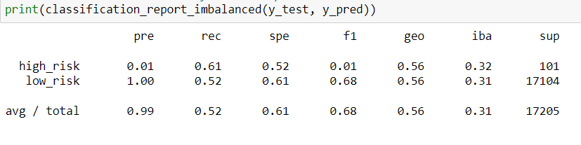
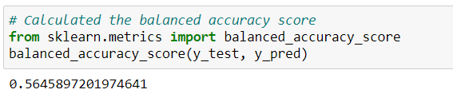
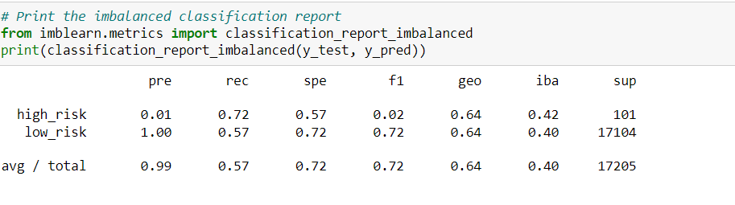
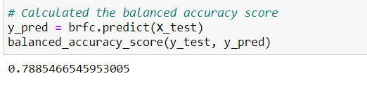
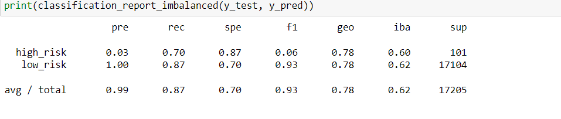
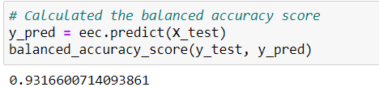
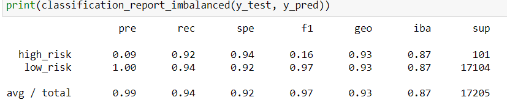

# Credit_Risk_Analysis
# Overview 
In this project, we are tasked with analyzing credit score. We use machine learning models to analyze risk of lending based on several credit factors.
## Results

 

 
-	Accuracy score: .66   
-	Precision  score: .90   
-	Recall score: .60  
-	f1 score: .75  

 

 
-	Accuracy score: .66  
-	Precision  score: .99  
-	Recall score: .69  
-	f1 score: .81  

 

 
-	Accuracy score: .57  
-	Precision  score: .99  
-	Recall score: .52  
-	f1 score: .68  

 

-	Accuracy score: .56  
-	Precision  score: .99  
-	Recall score: .57  
-	f1 score: .72  

 

 
-	Accuracy score: .79  
-	Precision  score: .99  
-	Recall score: .87  
-	f1 score: .93  

 
-	Accuracy score: .93  
-	Precision  score: .99  
-	Recall score: .94  
-	f1 score: .97  
## Summary  
The EasyEnsembleClassifier has the highest precision and sensitivity to correct predictions with a high accuracy score of .97. This accuracy is much higher than the other models all between .56 and .66. BalancedRandomForestClassifier model came pretty accurate with a score of .79 with a .97 f1 score showing to have great precision and sensitivity. I would recommend the EasyEnsembleClassifier model since it has the highest accuracy and balanced precision and recall score.
